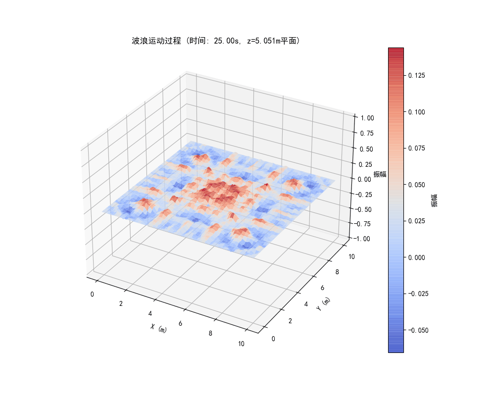
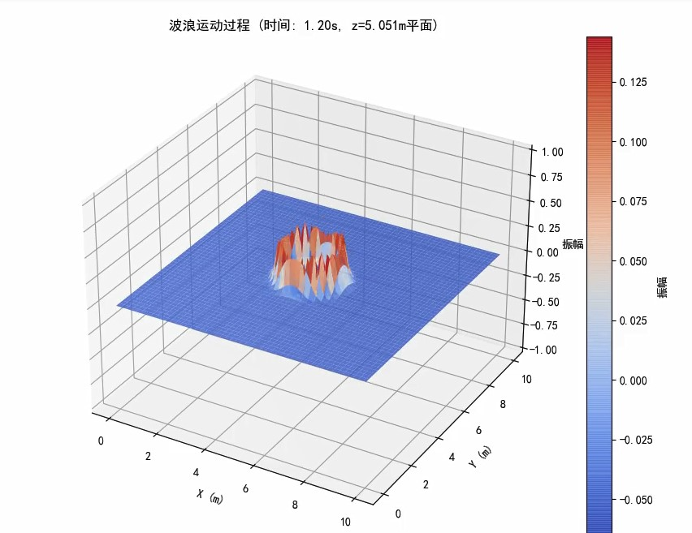

# 3D Wave Simulation - Finite Difference Method

A project simulating 3D wave propagation using the explicit finite difference method to solve the wave equation.

---

## Preview

### Wave Propagation Animation



### 3D Wave Simulation



---

## Project Overview

This project simulates 3D wave propagation using the explicit finite difference method to solve the wave equation. The simulation visualizes how a Gaussian pulse evolves over time in a 3D domain with fixed boundary conditions.

## Features

- **3D Wave Equation Solver**: Explicit finite difference scheme for the 3D wave equation
- **Gaussian Initial Condition**: Wave packet with Gaussian envelope
- **Stability Analysis**: Automatic CFL stability check
- **Multiple Visualizations**:
  - 3D surface plots at different time steps
  - Animated 3D wave propagation
  - Space-time heatmaps along coordinate axes
  - 3D isosurface visualization
- **Export Capabilities**: MP4 and GIF animation outputs

## Physics Background

The 3D wave equation:

```
∂²u/∂t² = c²(∂²u/∂x² + ∂²u/∂y² + ∂²u/∂z²)
```

Discretized using explicit finite differences with stability condition:

```
r = c²Δt²(1/Δx² + 1/Δy² + 1/Δz²) ≤ 1
```

## Requirements

```
numpy>=1.19.0
matplotlib>=3.3.0
scikit-image>=0.18.0
imageio>=2.9.0
```

## Installation

```bash
pip install numpy matplotlib scikit-image imageio
```

## Usage

```bash
python "main.py"
```

## Parameters

| Parameter | Default | Description |
|-----------|---------|-------------|
| Nx, Ny, Nz | 100 | Grid points in each direction |
| Lx, Ly, Lz | 10 m | Domain size |
| c | 1.0 m/s | Wave speed |
| dt | 0.01 s | Time step |
| total_time | 25 s | Total simulation time |

## Output Files

- `wave_3d_animation.mp4` - Animated wave propagation
- `wave_3d_animation.gif` - GIF animation

## Boundary Conditions

This simulation uses **fixed boundary conditions** (Dirichlet):
- u = 0 at all boundaries

## Numerical Method

- **Spatial Discretization**: Second-order central difference
- **Temporal Discretization**: Leap-frog scheme
- **Stability Condition**: CFL condition

## Project Structure

```
.
├── README.md
├── README_en.md
└── main.py
```

## Extension Ideas

1. Modify initial conditions (various wave packet shapes)
2. Adjust boundary conditions (reflective, absorbing)
3. Add obstacle simulation
4. Parallel computing acceleration (NumPy vectorization already included)

## References

- Finite Difference Methods for PDEs
- CFL Stability Condition: Courant, Friedrichs, Lewy (1928)

---

**Language**: [English](README_en.md) | [中文](README.md)
